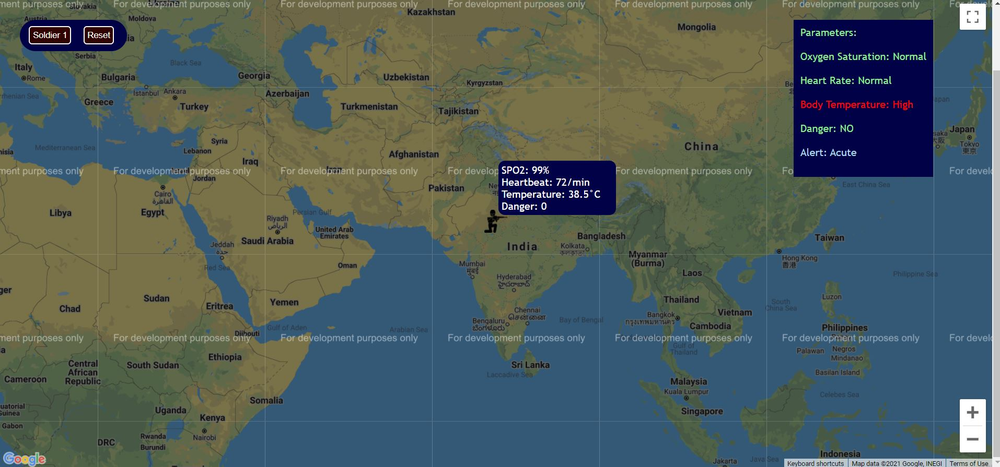
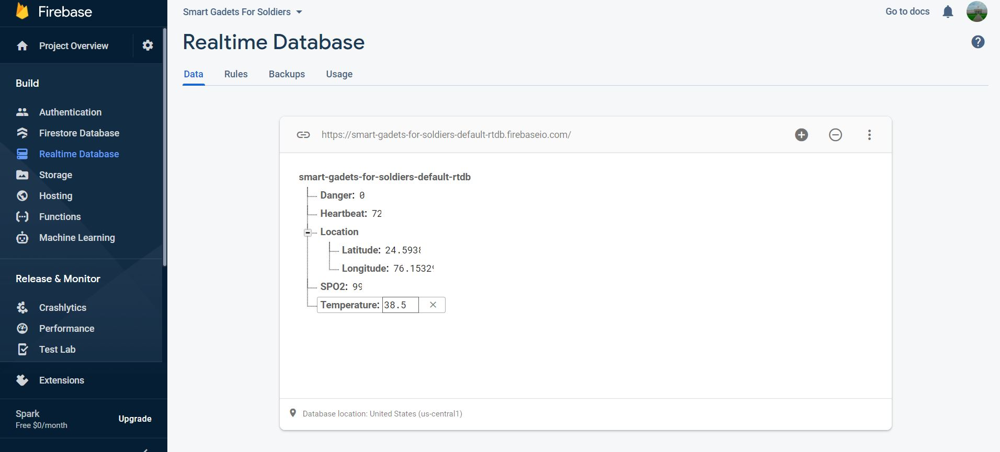

# Smart-Gadgets-For-Soldiers

Link: https://smartgadgetsforsoldiers.avichal.repl.co/

Steps to run:
1) Press the soldier 1 button twice to plot the soldier at the given location and Health Parameters of the soldier.
2) Press reset button if you want to reset the parameters.

<ul>
<li>The location and health parameters will get updated in realtime if the changes are made in the google firebase database at that instant.  </li>
<li>Upon hovering over the marker where the soldier has been plotted, a pop up appears which displays the health parameters.  </li>
  
<li>In case any parameter is above or below its normal level, an alert can be seen on the right side which has been color coded depending upon its level.   </li>
<li>The data of all these parameters would be sent to google firebase database in realtime using arduino, sensors and wifi module.  </li>
</ul>

<strong> A snapshot of the realtime database:</strong>   
 

